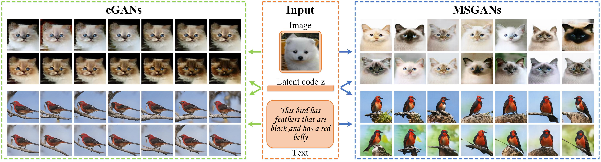
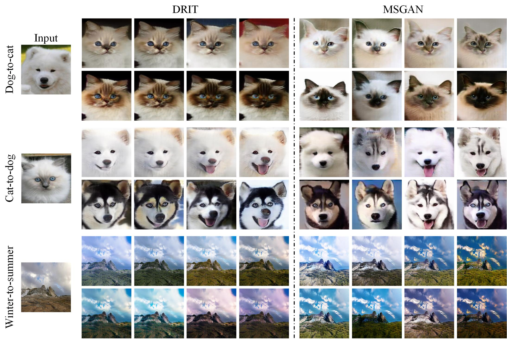

# Mode Seeking Generative Adversarial Networks for Diverse Image Synthesis

Pytorch implementation for our MSGAN (**Miss-GAN**). We propose a simple yet effective mode seeking regularization term that can be applied to **arbitrary** conditional generative adversarial networks in different tasks to alleviate the mode collapse issue and improve the **diversity**.

Contact: Qi Mao (qimao@pku.edu.cn), Hsin-Ying Lee (hlee246@ucmerced.edu), and Hung-Yu Tseng (htseng6@ucmerced.edu) 

## Paper
Mode Seeking Generative Adversarial Networks for Diverse Image Synthesis<br>
[Qi Mao](https://sites.google.com/view/qi-mao/)\*, [Hsin-Ying Lee](http://vllab.ucmerced.edu/hylee/)\*, [Hung-Yu Tseng](https://sites.google.com/site/hytseng0509/)\*, [Siwei Ma](https://scholar.google.com/citations?user=y3YqlaUAAAAJ&hl=zh-CN), and [Ming-Hsuan Yang](http://faculty.ucmerced.edu/mhyang/)<br>
IEEE Conference on Computer Vision and Pattern Recognition (CVPR), 2019 (* equal contribution)<br>
[[arxiv]](https://arxiv.org/abs/1903.05628)
## Citing MSGAN
If you find MSGAN useful in your research, please consider citing:
```
@inproceedings{MSGAN,
  author = {Mao, Qi and Lee, Hsin-Ying and Tseng, Hung-Yu and Ma, Siwei and Yang, Ming-Hsuan},
  booktitle = {IEEE Conference on Computer Vision and Pattern Recognition},
  title = {Mode Seeking Generative Adversarial Networks for Diverse Image Synthesis},
  year = {2019}
}
```
## Example Results


## Usage

### Prerequisites
- Python 3.5 or Python 3.6
- Pytorch 0.4.0 and torchvision (https://pytorch.org/)
- [TensorboardX](https://github.com/lanpa/tensorboard-pytorch)
- [Tensorflow](https://www.tensorflow.org/) (for tensorboard usage)

### Install
- Clone this repo:
```
git clone https://github.com/HelenMao/MSGAN.git
```
## Training Examples
Download datasets for each task into the dataset folder
```
mkdir datasets
```
### Conditoned on Label
- Dataset: [CIFAR-10](https://www.cs.toronto.edu/~kriz/cifar.html) 
- Baseline: DCGAN
```
cd MSGAN/DCGAN-Mode-Seeking
python train.py --dataroot ./datasets/Cifar10
```
### Conditioned on Image
- Paired Data: facades and maps
- Baseline: Pix2Pix <br>

You can download the facades and maps datasets from the BicycleGAN [[Github Project]](https://github.com/junyanz/BicycleGAN). <br>
We employ the network architecture of the BicycleGAN and follow the training process of Pix2Pix.
```
cd MSGAN/Pix2Pix-Mode-Seeking
python train.py --dataroot ./datasets/facades
```
- Unpaired Data: Yosemite (summer <-> winter) and Cat2Dog (cat <-> dog)
- Baseline: DRIT <br>

You can download the datasets from the DRIT [[Github Project]](https://github.com/HsinYingLee/DRIT). <br>
Specify `--concat 0` for Cat2Dog to handle large shape variation translation
```
cd MSGAN/DRIT-Mode-Seeking
python train.py --dataroot ./datasets/cat2dog
```
### Conditioned on Text
- Dataset: CUB-200-2011
- Baseline: StackGAN++ <br>

You can download the datasets from the StackGAN++ [[Github Project]](https://github.com/hanzhanggit/StackGAN-v2).
```
cd MSGAN/StackGAN++-Mode-Seeking
python main.py --cfg cfg/birds_3stages.yml
```
## Pre-trained Models
- [DCGAN-Mode-Seeking](https://drive.google.com/open?id=1eWq1nD-zJVEerru-_X5Ztpb8YbcYo7Px) 
- [Pix2Pix-Mode-Seeking for facades and maps](https://drive.google.com/open?id=1ZXnh090MFMrw8iSMjk5zvqXYY_nMmCoU)
- [DRIT-Mode-Seeking for Yosemite and Cat2dog](https://drive.google.com/open?id=1jLZHhWjxz_JyszU1_hj39l3_8zU9Hfkw)
- [StackGAN++-Mode-Seeking](https://drive.google.com/open?id=1tnDDolN-OMLG4BUNB6rPIjSXoP2FbXgw)

Download and save them into 
```
./models/
```

## Evaluation
For [Pix2Pix](https://github.com/junyanz/BicycleGAN), [DRIT](https://github.com/HsinYingLee/DRIT), and [StackGAN++](https://github.com/hanzhanggit/StackGAN-v2), please follow the instructions of corresponding github projects of the baseline frameworks for more evaluation details. <br>
### Testing Examples
**DCGAN-Mode-Seeking** <br>
```
python test.py --dataroot ./datasets/Cifar10 --resume ./models/DCGAN-Mode-Seeking/00199.pth
```
**Pix2Pix-Mode-Seeking** <br>
```
python test.py --dataroot ./datasets/facades --checkpoints_dir ./models/Pix2Pix-Mode-Seeking/facades --epoch 400
```
```
python test.py --dataroot ./datasets/maps --checkpoints_dir ./models/Pix2Pix-Mode-Seeking/maps --epoch 400
```
**DRIT-Mode-Seeking** <br>
```
python test.py --dataroot ./datasets/yosemite --resume ./models/DRIT-Mode-Seeking/yosemite/01200.pth --concat 1
```
```
python test.py --dataroot ./datasets/cat2dog --resume ./models/DRIT-Mode-Seeking/cat2dog/01999.pth --concat 0
```
**StackGAN++-Mode-Seeking** <br>
```
python main.py --cfg cfg/eval_birds.yml 
```

## Reference
- DCGAN [[Paper]](https://arxiv.org/abs/1511.06434)
- Pix2Pix and BicycleGAN [[Github Project]](https://github.com/junyanz/BicycleGAN) 
- DRIT [[Github Project]](https://github.com/HsinYingLee/DRIT)
- StackGAN++ [[Github Project]](https://github.com/hanzhanggit/StackGAN-v2)

## Quantitative Evaluation Metrics
- FID [[Github Project]](https://github.com/bioinf-jku/TTUR)
- LPIPS [[Github Project]](https://github.com/richzhang/PerceptualSimilarity)
- NDB and JSD [[Github Project]](https://github.com/eitanrich/gans-n-gmms)
